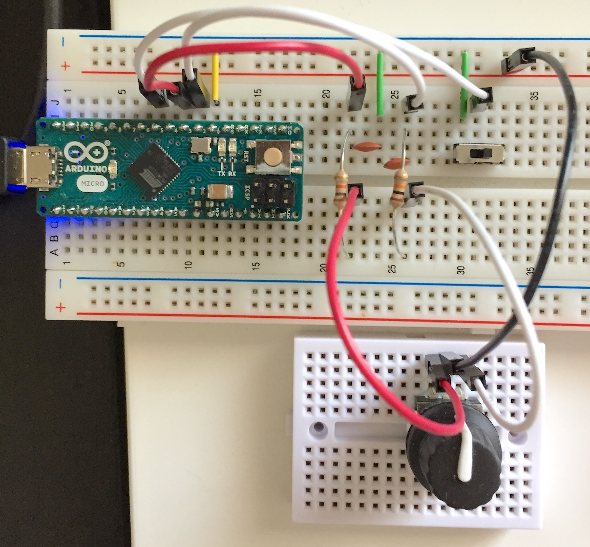

# RotaryController

An Arduino sketch to turn a simple rotary encoder into a keyboard with very
limited functionality.

## Materials
1. An [Arduino Micro](https://www.arduino.cc/en/Main/ArduinoBoardMicro).
   However, any other ATmega32U4 microcontroller should do.
2. A [rotary encoder](https://www.adafruit.com/products/377)
3. 2 10K ohm resistors for the debounce circuit
4. 2 .1uF capacitors (I used ceramic 104 capacitors) for the debounce circuit
5. A switch

## Setup

Most of the circuitry that does not involve the Arduino is the debounce circuit.
